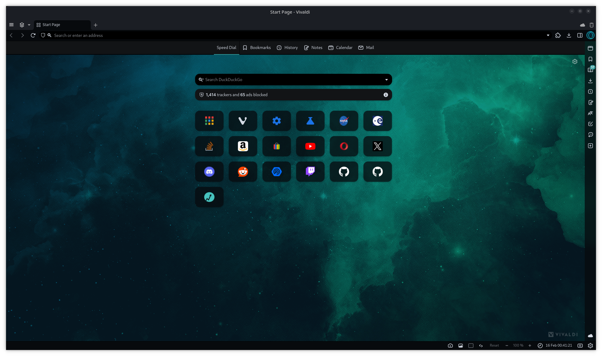
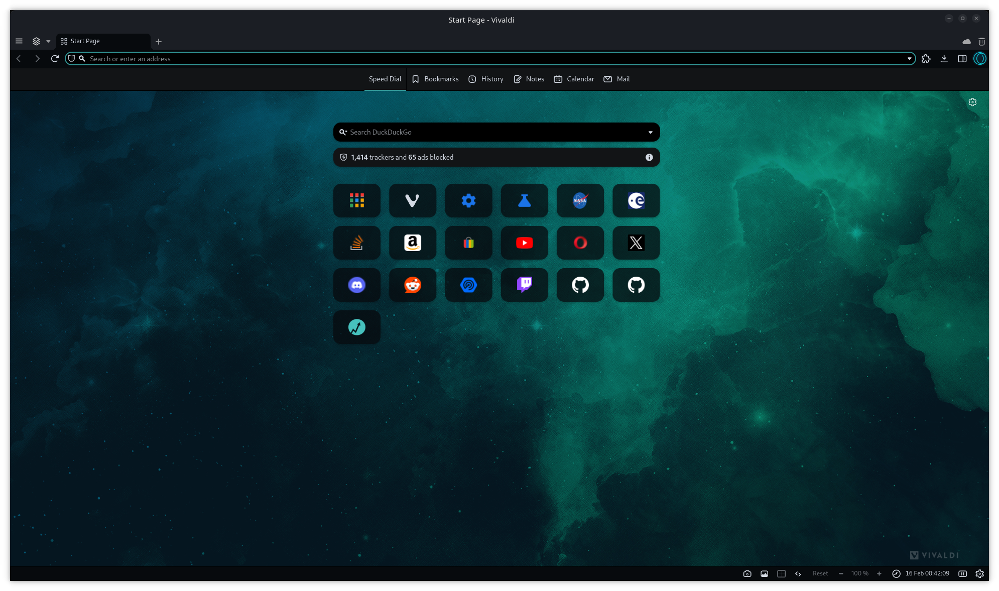

# Vivaldi Darkling Theme

My ***"Darkling"*** theme for Vivaldi Web Browser.

Style inspired by the (discontinued) Opera Crypto Design Language (which used to be my web browser of choice) coupled with an original Vivaldi background image[^1].

> [!NOTE]
> Vivaldi is in my opinion the most highly customisable and satisfactory web browser I have discovered to date. Even though it uses Chromium under the hood, I do not have too much quarrel with that since it is open source. The Vivaldi source on the other hand appears to be closed source but, for me it isn't too hard to examine, use, and report on. I thoroughly enjoy the Vivaldi web browser experience, as a user, and as a developer.

## Install Theme

Simply download the [vivaldi-darkling-theme.zip](./dist/vivaldi-darkling-theme.zip) and import to your Vivaldi Web Browser via the theme settings page.

| Toolbar | Accent |
|:------:|:------:|
|  |  |

I located and modified the application icon to suit my desktop environment. The idea came from the ability to change the app icon for Vivaldi on Android within the browser settings.

## Application Icon

Download [vivaldi.svg](./assets/vivaldi.svg) and save to your `.local/share/icons/Colloid/apps/scalable/` folder.

- Location of the scalable icon folder may differ depending upon your setup.
- If you cannot find such a folder, search your system for `vivaldi.svg` with `find / -type f -name "vivaldi.svg"`

After installing, you may need to reboot to reinitialise icon cache.

| Dark Version | Original Version |
|:------:|:------:|
|  |  |

> [!TIP]
> - The logo at the top right in the preview is my profile image, which compliments the theme.
> - Since this is just the theme, you may have to adjust your toolbars and other settings to achieve the results in the examples above.
> - If you wish to acquire my exact settings for Vivaldi Web Browser, you will have to contact me privately.
> - My KDE desktop & window styling is a highly customised version of *Lavanda Sea Dark* with Kvantum Enhancements, on SDDM.

[^1]: Sourced from the Vivaldi Discord Community landing page: https://discord.com/invite/vivaldi-170121320825225218
